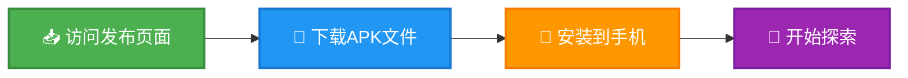
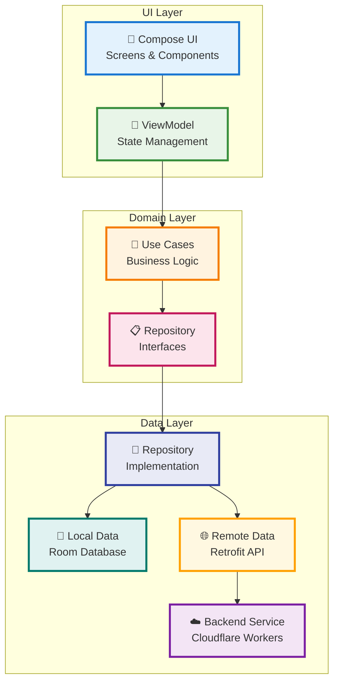
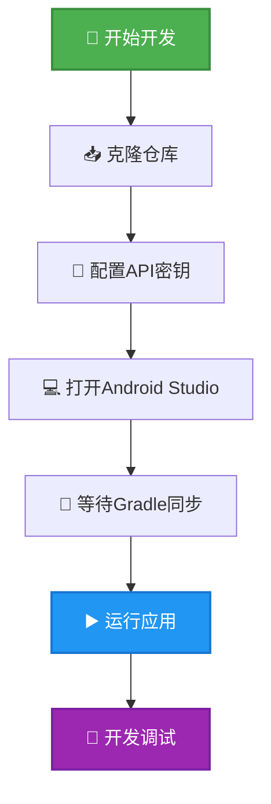
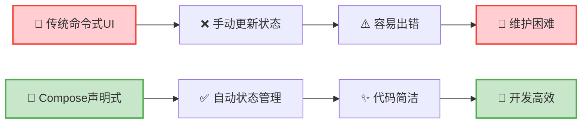
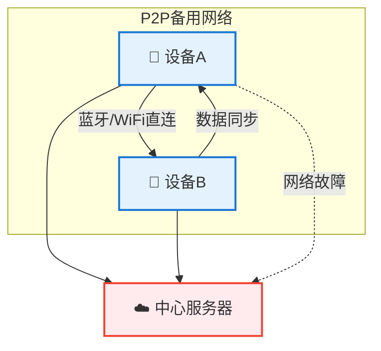
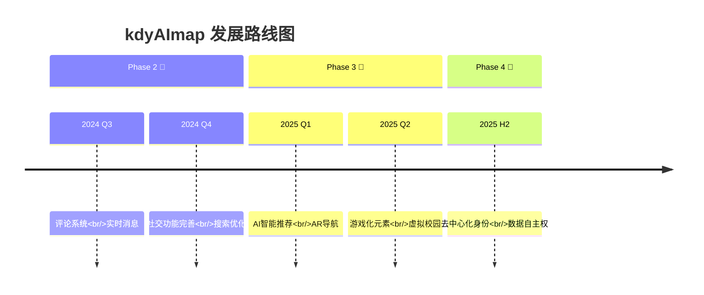
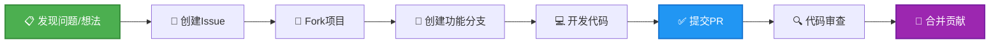

# kdyAImap | 🗺️ 一个有灵魂的校园AI地图

<div align="center">


> **✨ 致未来的探索者：**
>
> 当你打开这份文档，你看到的不仅是一个项目，更是一段关于创造与成长的旅程。`kdyAImap` 的每一行代码都承载着我们对理想校园生活的憧憬，每一次提交都是向着更美好校园迈出的一步。
>
> 我们相信技术应该有温度，它不该是冰冷的逻辑，而应是连接人与人的桥梁。这个项目，就是我们用代码写下的校园诗篇。
>
> 别害怕，大胆探索、修改、甚至"破坏"它吧！开源的精神就是相信"我来我也行"，并最终实现"我们一起来，世界更精彩"。
>
> **现在，让我们一起开启这场有趣的冒险！** 🚀

</div>

---

## 📖 项目简介 | What is kdyAImap?

`kdyAImap` 是一个专为大学校园设计的 **智能地图社交应用**，旨在让校园信息像呼吸一样自然地流动起来。

**🎯 我们的使命：** 打破信息壁垒，连接校园生活的每一个精彩瞬间——无论是寻找学术讲座、参与社团活动，还是淘到心仪的二手宝贝。

---

## ✨ 核心功能 | Core Features

<div align="center">

| 功能模块 | 图标 | 描述 |
|---------|------|------|
| **智能事件地图** | 🗺️ | 在地图上实时查看、发布和参与各类校园活动 |
| **P2P网络黑科技** | 🤝 | 设备间点对点通信，网络不佳时仍能保持核心功能 |
| **校园二手市场** | 🛒 | 内置"校园闲鱼"，促进资源循环利用 |
| **即时社交系统** | 💬 | 关注好友、私信交流、组建学习小组 |
| **性能监控套件** | 📊 | 企业级性能监控，确保应用流畅运行 |
| **安全隐私保护** | 🔐 | 本地加密、权限最小化，守护你的数据安全 |

</div>

---

## 💝 设计理念 | Project Philosophy

<div align="center">

| 原则 | 图标 | 说明 |
|------|------|------|
| **信息平权** | ⚖️ | 每个学生都应有平等获取校园信息的权利 |
| **技术向善** | 🌟 | 技术服务于人，让校园生活更温暖 |
| **开放共享** | 🔄 | 拥抱开源，鼓励社区共同建设 |
| **协作成长** | 🌱 | 从个人创意到社区共创的进化之路 |

</div>

---

## 🚀 快速开始 | Quick Start

### 一键安装体验

<div align="center">



**[👉 点击下载最新版本](https://github.com/lzA6/kdyAImap/releases)**

</div>

---

## 🏗️ 架构设计 | Architectural Design

### 技术架构全景图



### 项目结构树

```
📂 kdyAImap/
├── 📄 .gitignore
├── 📄 README.md
├── 📄 build.gradle.kts
├── 📂 app/ (主应用模块)
│   ├── 📂 src/main/
│   │   ├── 📄 MainActivity.kt
│   │   ├── 📂 di/ (依赖注入)
│   │   ├── 📂 location/ (地图定位)
│   │   ├── 📂 ui/ (用户界面)
│   │   │   ├── 📂 components/ (通用组件)
│   │   │   ├── 📂 navigation/ (导航)
│   │   │   ├── 📂 screens/ (页面)
│   │   │   ├── 📂 theme/ (主题)
│   │   │   └── 📂 viewmodel/ (视图模型)
│   │   └── 📂 util/ (工具类)
├── 📂 core/ (核心业务模块)
│   ├── 📂 data/ (数据层)
│   ├── 📂 domain/ (领域层)
│   └── 📂 model/ (数据模型)
└── 📂 my-map-backend/ (后端服务)
    ├── 📄 schema.sql
    └── 📂 src/
        └── 📄 index.ts
```

---

## 🛠️ 技术栈 | Technology Stack

<div align="center">

| 技术领域 | 选用技术 | 评级 | 优势说明 |
|---------|----------|------|----------|
| **核心语言** | Kotlin | ⭐⭐⭐⭐⭐ | Google官方首选，现代安全 |
| **UI框架** | Jetpack Compose | ⭐⭐⭐⭐⭐ | 声明式UI，开发高效 |
| **架构模式** | Clean Architecture + MVVM | ⭐⭐⭐⭐⭐ | 高度解耦，易于维护 |
| **异步编程** | Kotlin Coroutines & Flow | ⭐⭐⭐⭐⭐ | 异步处理优雅简洁 |
| **依赖注入** | Hilt | ⭐⭐⭐⭐☆ | 简化依赖管理 |
| **本地存储** | Room | ⭐⭐⭐⭐⭐ | 官方ORM，类型安全 |
| **网络请求** | Retrofit + OkHttp | ⭐⭐⭐⭐⭐ | 行业黄金标准 |
| **后端服务** | Cloudflare Workers | ⭐⭐⭐⭐☆ | Serverless，全球加速 |
| **地图服务** | 高德地图 | ⭐⭐⭐⭐☆ | 国内数据精准 |
| **P2P网络** | 自定义协议 | ⭐⭐⭐⭐⭐ | 高可用性保障 |

</div>

---

## 🔧 开发指南 | Development Guide

### 环境搭建

<div align="center">



</div>

### 详细步骤

1. **克隆项目**
   ```bash
   git clone https://github.com/lzA6/kdyAImap.git
   cd kdyAImap
   ```

2. **配置环境**
   - 创建 `local.properties` 文件
   - 添加高德地图API Key：
     ```properties
     AMAP_KEY="你的高德地图Key"
     ```

3. **编译运行**
   ```bash
   ./gradlew installDebug
   ```

---

## 🧠 核心原理 | Core Principles

### Jetpack Compose：声明式UI革命

<div align="center">



</div>

### Hilt依赖注入：智能快递系统

```kotlin
@HiltViewModel
class MainViewModel @Inject constructor(
    private val userRepository: UserRepository // 🎁 自动注入
) : ViewModel() {
    // 直接使用，无需手动创建
}
```

### P2P网络：智能备用通道

<div align="center">



</div>

---

## 📊 项目进展 | Project Status

### ✅ 已完成功能

<div align="center">

| 模块 | 状态 | 完成度 |
|------|------|--------|
| **核心架构** | 🟢 完成 | 100% |
| **用户系统** | 🟢 完成 | 95% |
| **地图功能** | 🟢 完成 | 90% |
| **事件系统** | 🟢 完成 | 85% |
| **二手市场** | 🟢 完成 | 80% |
| **性能监控** | 🟢 完成 | 90% |

</div>

### 🚧 开发中功能

<div class="progress-container">
  <div class="progress-bar" style="width: 65%">社交系统 (65%)</div>
  <div class="progress-bar" style="width: 40%">消息推送 (40%)</div>
  <div class="progress-bar" style="width: 30%">搜索功能 (30%)</div>
  <div class="progress-bar" style="width: 20%">离线地图 (20%)</div>
</div>

---

## 🌟 未来规划 | Future Roadmap

### 技术优化
- 🔧 **代码重构** - 统一代码风格，移除冗余文件
- 🧪 **测试覆盖** - 增加单元测试和UI测试
- 🎨 **UI/UX升级** - 引入专业设计，提升用户体验
- 🖼️ **图片优化** - 集成图片缓存和CDN支持

### 功能扩展
<div align="center">



</div>

### 创新愿景

1. **🤖 AI智能推荐**
   - 个性化活动推荐
   - 智能学习伙伴匹配

2. **👁️ AR实景导航**
   - 摄像头实时导航
   - 虚拟信息叠加

3. **🔗 去中心化架构**
   - 用户数据自主控制
   - 分布式身份管理

---

## 🤝 贡献指南 | How to Contribute

<div align="center">



</div>

### 贡献方式
- 🐛 **报告Bug** - 在Issues页面提交详细报告
- 💡 **提出建议** - 分享你的创意和想法  
- 🔧 **代码贡献** - 直接参与功能开发
- 📚 **文档改进** - 帮助完善使用文档

---

## 📜 开源协议 | License

本项目采用 **Apache 2.0** 开源协议。

> 📄 **协议要点：**
> - ✅ 允许商业使用
> - ✅ 允许修改和分发
> - ✅ 允许专利使用
> - 📝 需要保留版权声明
> - 📝 需要包含协议文本

查看完整协议：[LICENSE文件](https://github.com/lzA6/kdyAImap/blob/main/LICENSE)

---

## 🙏 致谢 | Acknowledgements

感谢所有为这个项目贡献智慧的开发者，感谢开源社区提供的优秀工具，也感谢正在阅读这份文档的你。

**🌟 特别鸣谢：**
- 所有代码贡献者
- 问题反馈和测试用户
- 开源社区的支持
- 校园里的每一位使用者

<div align="center">

---

**🎯 让我们一起，用代码让校园生活变得更美好！**

**⭐ 如果这个项目对你有帮助，请给我们一个Star！**

---

</div>

<style>
.progress-container {
  background: #f0f0f0;
  border-radius: 10px;
  margin: 10px 0;
  overflow: hidden;
}

.progress-bar {
  background: linear-gradient(90deg, #4CAF50, #8BC34A);
  color: white;
  padding: 8px 15px;
  text-align: left;
  font-weight: bold;
  transition: width 0.5s ease;
}

/* 响应式设计 */
@media (max-width: 768px) {
  .progress-bar {
    font-size: 12px;
    padding: 6px 10px;
  }
}
</style>
